# PDF Builder for Salesforce (Beta)

<p align="center">
  
</p>

<p align="center">
  <a href="https://app.codacy.com/gh/mpdigitals/pdf-builder-sfdc/dashboard"></a>
  <a href="https://github.com/mpdigitals/pdf-builder-sfdc/releases/latest"></a>
</p>

<p align="center">
  <strong>Native WYSIWYG document generation for Salesforce any standard or custom object, no external rendering service.</strong>
</p>

PDF Builder is a Salesforce-native application for visually designing reusable PDF templates, merging live record data, previewing the result, and generating production documents without leaving the platform.

The authoring and rendering flow runs entirely in Salesforce using Lightning Web Components, Apex, Custom Metadata, custom objects, Salesforce Files, and Salesforce's native PDF conversion.

## Live demo

Try the complete PDF Builder workflow in the public Salesforce Experience Cloud demo:

<p align="center">
  <a href="https://pdfbuild-dev-ed.trailblaze.my.site.com/"><strong>Open the PDF Builder live demo</strong></a>
</p>

Design and preview sample Opportunity and Quote templates, then generate PDFs from the demo record pages.

The demo is desktop-optimized and read-only. Install PDF Builder to save template changes and use the complete functionality.

## Why PDF Builder?

<table>
  <tr>
    <td colspan="3" align="center"></td>
  </tr>
  <tr>
    <td width="33.33%">Runs entirely on the Salesforce platform with no middleware or external rendering engine.</td>
    <td width="33.33%">Build templates for accessible standard or custom objects, including parent fields and related-list data.</td>
    <td width="33.33%">Create layouts visually with rich text, images, tables, lines, spacing, positioning, headers, footers, and pagination.</td>
  </tr>
  <tr>
    <td colspan="3" align="center"></td>
  </tr>
  <tr>
    <td>Download documents or save sequentially labelled copies directly in Salesforce Files.</td>
    <td>Preview and generate against real Salesforce records while respecting the running user's access.</td>
    <td>Runtime and rendering behavior is controlled through deployable Custom Metadata.</td>
  </tr>
</table>

## Installation

Salesforce Quotes is not required. Quote support is built in and detected at
runtime: when Quotes is enabled, Quote templates are available and generated
documents are saved in the standard **Quote PDFs** related list. When Quotes is
not enabled, PDF Builder deploys and works normally with the other supported
objects. No additional package or configuration is needed for Quote support.

### Recommended: unlocked package

Install the released unlocked package. Sandbox and production use the same
versioned artifact, so the package tested in a sandbox is exactly the package
installed in production.

| Target            | Installation link                                                                                                 |
| ----------------- | ----------------------------------------------------------------------------------------------------------------- |
| Sandbox           | [Install in a sandbox](https://test.salesforce.com/packaging/installPackage.apexp?p0=04tQy000000ZFLxIAO)          |
| Developer Edition | [Install in Developer Edition](https://login.salesforce.com/packaging/installPackage.apexp?p0=04tQy000000ZFLxIAO) |

Log in to the target org, select **Install for Admins Only** or the access level
required by your security model, and complete the installation. Then assign the
included `PDF Builder User` permission set to each user who needs the app.

The same version can also be installed with Salesforce CLI:

```bash
sf package install \
  --package 04tQy000000ZFLxIAO \
  --target-org pdf-builder-target \
  --wait 30 \
  --publish-wait 10 \
  --no-prompt
```

### Alternative: deploy from source

**Quick start:** Deploy → assign the permission set → add the generator to a record page → import samples (optional) → generate a PDF.

Source deployment is intended for contributors and organizations that want to
inspect or modify the application. It requires Salesforce CLI (`sf`) and Git.

```bash
git clone https://github.com/mpdigitals/pdf-builder-sfdc.git
cd pdf-builder-sfdc

sf org login web --alias pdf-builder-target
sf project deploy start --manifest manifest/pdf-builder.xml --target-org pdf-builder-target
sf org assign permset --name PDFBuilderUser --target-org pdf-builder-target
```

After deployment:

1. Add the **PDF Builder** tab to the desired Lightning application if it is not already visible.
2. Assign the `PDF Builder User` permission set to template authors and document generators.
3. Add **PDF Builder PDF Generator** to the required Lightning record pages.
4. Review the `PDFBuilderSettings.Default` Custom Metadata record before production use.
5. Create a template or import the optional sample data.

Opportunity and Quote Lightning record pages are intentionally not included,
so deployment never replaces an organization's existing pages. To expose PDF
generation on a record:

1. Open **Setup → Object Manager** and select the object.
2. Open **Lightning Record Pages** and edit or create the required page.
3. Drag **PDF Builder PDF Generator** onto the page.
4. Save and activate the page for the required apps, profiles, or record types.

The same component works on Opportunity, Quote (when Quotes is enabled), and
other supported record pages. It receives the current record ID automatically.

### Optional sample templates

[`sample-data/pdf-builder-templates.csv`](sample-data/pdf-builder-templates.csv) contains two optional examples:

- **MP Digitals Opportunity Proposal** for `Opportunity`.
- **MPDigitals Quote** for `Quote`.

The Quote example uses the packaged `PDFBuilderSampleMPDigitalsLogo` static resource. The samples are demonstration content and should be rebranded and reviewed before production use.

You can import the CSV with Salesforce Inspector, Data Loader, or Salesforce CLI:

```bash
sf data import bulk \
  --sobject PDFBuilderTemplate__c \
  --file sample-data/pdf-builder-templates.csv \
  --wait 10 \
  --target-org pdf-builder-target
```

The CSV does not contain source-org record IDs. Imported templates receive new IDs in the target org.

## 🎨 Visual WYSIWYG Builder

Design professional templates visually with drag & drop layout, live preview, reusable document structure, and record-aware data.

<table>
  <tr>
    <td align="center">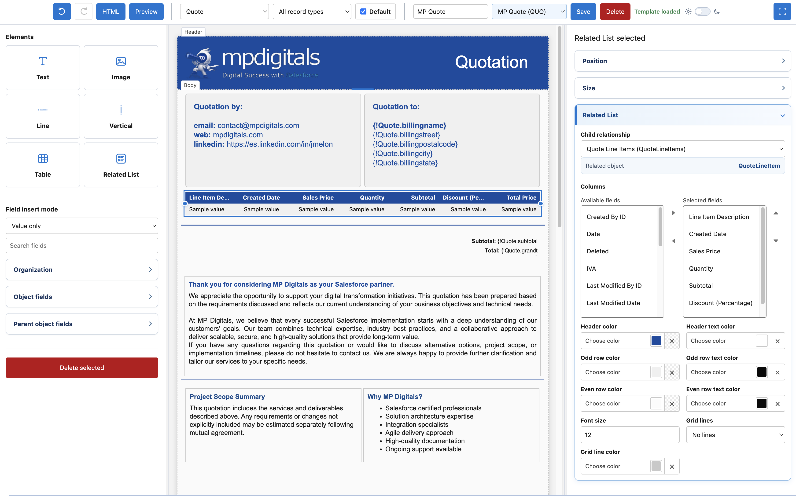</td>
  </tr>
</table>

### Template design

The `PDF Builder` Lightning tab opens the authoring workspace. Its three-column layout keeps the element palette, document canvas, and contextual properties visible while editing.

The toolbar provides undo and redo history, generated HTML inspection, record-aware preview, object and template selection, save and delete actions, and fullscreen editing.

<p align="center">
  
</p>

### Elements

| Element      | Purpose                                                                                                         |
| ------------ | --------------------------------------------------------------------------------------------------------------- |
| Text         | Rich text, static copy, and merge fields with font, color, alignment, spacing, border, and background controls. |
| Image        | Images uploaded to or selected from Salesforce Files, plus packaged static-resource images.                     |
| Line         | Configurable horizontal divider with length, color, style, and thickness.                                       |
| Vertical     | Configurable vertical divider.                                                                                  |
| Table        | Static rows and columns with cell padding, borders, and vertical alignment.                                     |
| Related List | Dynamic child records with selectable and reorderable columns, zebra colors, font sizing, and border modes.     |

<p align="center">
  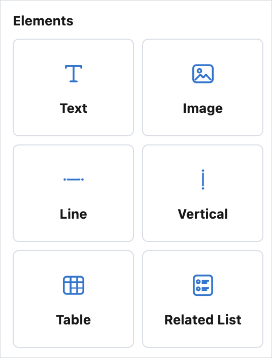
</p>

Elements can be moved and resized on the canvas. Undo and redo preserve the editing workflow, and fullscreen mode provides more room for complex templates.

Selected elements can also be copied, pasted, or deleted from their contextual controls.

<p align="center">
  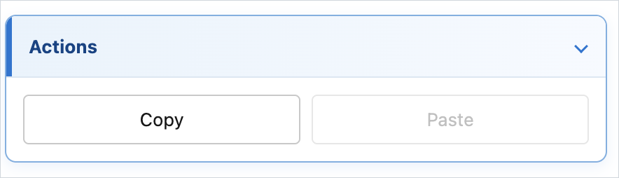
  &nbsp;&nbsp;
  
</p>

### Page layout

Each template has optional header, body, and footer regions. The dashed outlines visible in the builder are editing guides only; they do not become PDF borders unless a real border is configured.

The layout supports:

- configurable page and global element padding;
- one or two body sections;
- optional header and footer regions;
- repeating header and footer content on subsequent pages;
- additional manual pages;
- per-region and per-element appearance and sizing;
- automatic preview pagination for overflowing content and related-list rows.

<p align="center">
  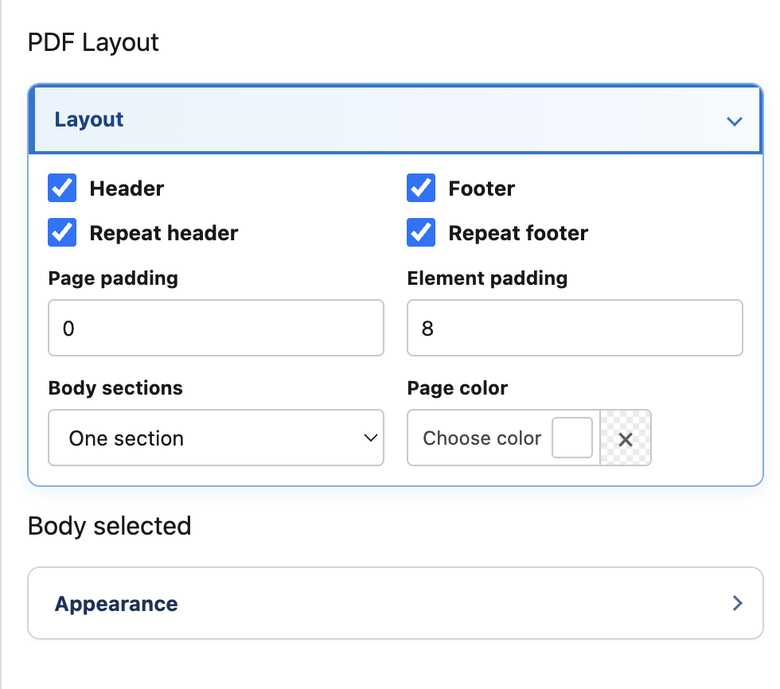
</p>

## Dynamic data

Fields can be inserted as a value, a label, or a combined label and value. The builder exposes only objects and fields available to the current user.

### Merge-field sources

| Source         | Example                                | Notes                                                                   |
| -------------- | -------------------------------------- | ----------------------------------------------------------------------- |
| Current record | `{!Opportunity.Name}`                  | Direct fields on the object associated with the template.               |
| Parent record  | `{!Opportunity.Account.Name}`          | First-level relationship paths selected through the parent-field panel. |
| Organization   | `{!$Organization.Name}`                | Organization name, primary contact, division, phone, fax, and address.  |
| Current user   | `{!$User.Name}`                        | Supported current-user fields resolved during generation.               |
| Related list   | Configured in the Related List element | Child relationship and selected columns are resolved into table rows.   |

Salesforce values are formatted for the running user. This includes locale-aware dates, numbers, currencies, percentages, and field labels.

The field browser groups organization, current-object, and parent-object fields. Authors can search the available fields and choose whether an inserted field displays its value, label, or both.

#### Browse available data

<p align="center">
  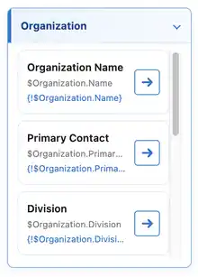
  &nbsp;
  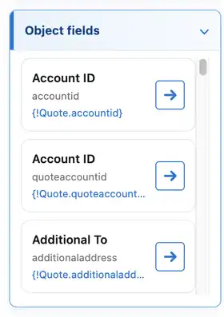
  &nbsp;
  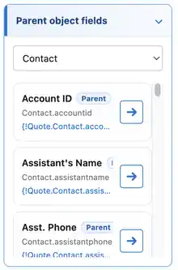
</p>

#### Control how fields are inserted

<p align="center">
  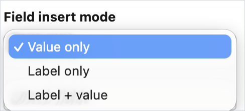
  &nbsp;&nbsp;
  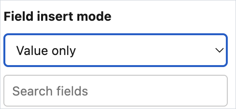
</p>

## Generating PDFs

<p align="center"><strong>Select template</strong> → <strong>Preview</strong> → <strong>Generate</strong> → <strong>Download or save to Salesforce Files</strong></p>

Add the exposed `PDF Builder PDF Generator` LWC to any supported Lightning record page. At runtime it lists only templates associated with that page's object.

Users can choose one of two destinations:

1. **Download to computer** — generates the PDF and downloads it through the browser.
2. **Save to Salesforce Files** — saves and links the PDF to the current record, then provides an action to open the saved file.

The builder also provides a preview modal. Enter a record ID from the template's configured object to inspect merged fields and related-list rows before saving the template or generating a final document.

<table>
  <tr>
    <td align="center">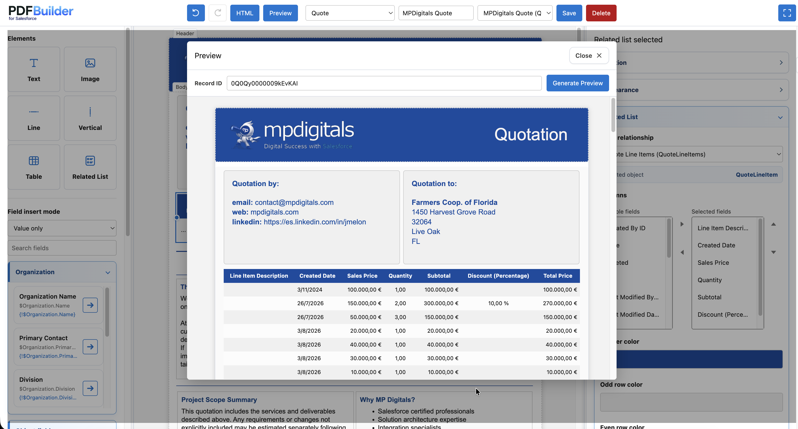</td>
  </tr>
</table>

On a Lightning record page, users select an available template and choose whether to download the result or save it to Salesforce Files. A saved document can be opened directly from the component.

<p align="center">
  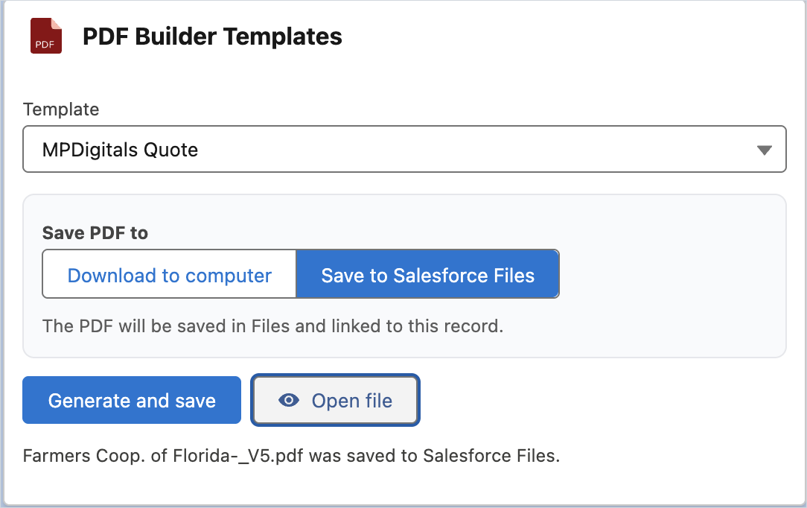
</p>

<table>
  <tr>
    <td align="center">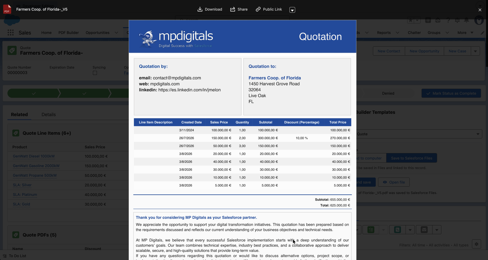</td>
  </tr>
</table>

## Architecture

**Everything runs inside Salesforce.** The visual builder creates the template model, Salesforce data and schema are resolved at runtime, the document engine merges and prepares the content, and the final PDF is produced through a Salesforce-native HTML-to-PDF rendering layer before being downloaded or saved to Salesforce Files.

<p align="center">
  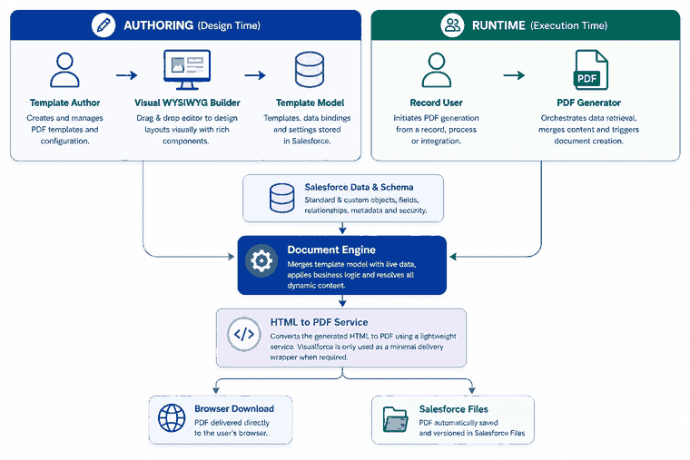
</p>

### Main components

<details>
<summary><strong>View implementation components</strong></summary>

| Layer                | Components                                                                       | Responsibility                                                                                      |
| -------------------- | -------------------------------------------------------------------------------- | --------------------------------------------------------------------------------------------------- |
| Authoring UI         | `pdfBuilder`, `pdfBuilderBlock`, `pdfBuilderRichTextCommands`, `pdfBuilderUtils` | Template editing, history, layout, preview pagination, HTML generation, and client-side validation. |
| Record UI            | `pdfBuilderGenerator`                                                            | Template selection and PDF download or Salesforce Files persistence from a record page.             |
| Facade/orchestration | `PDFBuilderController`                                                           | Stable LWC API, merge-field resolution, preview orchestration, and PDF generation.                  |
| Configuration        | `PDFBuilderConfiguration`                                                        | Loads and validates the authoritative `PDFBuilderSettings.Default` Custom Metadata record.          |
| Schema access        | `PDFBuilderDescribeService`                                                      | Discovers accessible objects, fields, parent fields, and child relationships.                       |
| Persistence          | `PDFBuilderTemplateRepository`                                                   | Reads and writes templates in user mode.                                                            |
| File handling        | `PDFBuilderFileService`                                                          | Finds and uploads images, stores and sequences generated PDFs, and resolves renderable image URLs.  |
| PDF delivery         | `PDFBuilderPdfPageController`, `PDFBuilderPdf.page`                              | Passes already prepared HTML and page geometry to Salesforce's native PDF conversion.               |

</details>

There are no required callouts, middleware services, or external databases.

Visualforce is used only as the minimal server-side container required to
invoke Salesforce's native PDF output. It does not build templates, merge
record data, or implement document layout; those responsibilities live in LWC
and Apex.

## Technical reference

### Data model

#### `PDFBuilderTemplate__c`

| Field              | Purpose                                                    | Limit              |
| ------------------ | ---------------------------------------------------------- | ------------------ |
| `Name`             | Human-readable template name.                              | 80 characters      |
| `ObjectApiName__c` | API name of the Salesforce object used by the template.    | 255 characters     |
| `ContentJson__c`   | Canonical editable document model.                         | 131,072 characters |
| `GeneratedHtml__c` | Generated browser-preview HTML retained with the template. | 131,072 characters |

### Configuration

Runtime behavior is controlled by the public Custom Metadata type `PDFBuilderSettings__mdt`. The application requires the record whose Developer Name is `Default`; missing or invalid required values raise an explicit configuration error instead of silently applying inconsistent defaults.

All dimensions use CSS pixels unless stated otherwise.

<details>
<summary><strong>View full configuration reference</strong></summary>

| Field API name               |                 Default | Description                                                                                                                                                                                           |
| ---------------------------- | ----------------------: | ----------------------------------------------------------------------------------------------------------------------------------------------------------------------------------------------------- |
| `PreferredObjectApiNames__c` |               See below | Object API names displayed first in the object selector. Accepts one name per line or comma-separated values. Invalid or unavailable objects are ignored.                                             |
| `IncludeCustomObjects__c`    |                  `true` | When enabled, appends accessible custom objects to the selector. Preferred objects are still shown when accessible, including explicitly listed custom objects. Custom Metadata objects are excluded. |
| `SupportedImageTypes__c`     | `PNG,JPG,JPEG,GIF,WEBP` | Comma-separated Salesforce `FileType` values accepted by the image picker.                                                                                                                            |
| `LongTextLimit__c`           |                `131072` | Maximum accepted length for each template JSON and generated HTML value. Keep this at or below the corresponding Salesforce field length.                                                             |
| `PageWidthPx__c`             |                   `794` | Canonical page width shared by the builder, preview, and PDF renderer. The default approximates A4 at 96 DPI.                                                                                         |
| `PageHeightPx__c`            |                  `1123` | Canonical page height shared by the builder, preview, and PDF renderer. The default approximates A4 at 96 DPI.                                                                                        |
| `DefaultPagePaddingPx__c`    |                    `32` | Initial inner padding for newly created template pages.                                                                                                                                               |
| `DefaultElementPaddingPx__c` |                     `8` | Initial inner padding assigned to newly created elements.                                                                                                                                             |
| `DefaultHeaderHeightPx__c`   |                   `110` | Initial header-region height for new templates.                                                                                                                                                       |
| `DefaultFooterHeightPx__c`   |                    `80` | Initial footer-region height for new templates.                                                                                                                                                       |
| `MaxPages__c`                |                     `5` | Maximum number of manual pages available in the builder. Automatically paginated preview/output can still span pages according to content.                                                            |
| `TemplateQueryLimit__c`      |                   `200` | Maximum number of templates returned to a selector. Valid range: 1–2,000.                                                                                                                             |
| `ImageQueryLimit__c`         |                    `60` | Maximum number of matching Salesforce Files returned by the image picker. Valid range: 1–200.                                                                                                         |
| `MaxClientImageBase64__c`    |               `1800000` | Maximum Base64 string length accepted when a user uploads an image from the builder.                                                                                                                  |
| `PdfContentWidthPx__c`       |                   `540` | Compatibility content width used when translating legacy positioned layouts.                                                                                                                          |
| `PdfCanvasWidthPx__c`        |                   `620` | Compatibility canvas width used when translating legacy positioned layouts.                                                                                                                           |
| `PdfFontScale__c`            |                  `0.96` | Font-metric compensation applied to server-side PDF output.                                                                                                                                           |
| `PdfImageYOffsetPx__c`       |                     `9` | Vertical image-alignment compensation for server-side PDF output.                                                                                                                                     |
| `PdfGridColumns__c`          |                    `12` | Column count used by the compatibility PDF grid layout.                                                                                                                                               |
| `PdfGridGapPx__c`            |                     `8` | Gap between compatibility PDF grid columns.                                                                                                                                                           |
| `PdfGridRowHeightPx__c`      |                    `24` | Row height used by the compatibility PDF grid.                                                                                                                                                        |
| `DragGridSizePx__c`          |                    `10` | Positioning increment used while dragging elements.                                                                                                                                                   |
| `InputDebounceMs__c`         |                   `250` | Delay in milliseconds for inputs that defer expensive document updates.                                                                                                                               |

</details>

The default preferred-object order is:

```text
Lead, Account, Contact, Opportunity, Quote, Contract, ServiceContract,
Order, Case, Campaign, Product2, Pricebook2, Asset, WorkOrder, User
```

Only objects that exist in the target org and are available to the running user are shown.

### Security considerations

- Apex entry points use `with sharing`; supporting services use `with sharing` or `inherited sharing` according to their role.
- Template and file queries use user-mode access, and object/field discovery filters unavailable schema entries.
- The supplied permission set grants access to the PDF Builder classes, PDF delivery container, tabs, configuration, and template object. Access to source objects and fields still comes from the user's own profiles and permission sets.
- PDF generation never grants access to record data the running user cannot read.
- Saving a PDF requires permission to create Salesforce Files. Deleting or editing templates requires the corresponding object permissions.
- Template HTML is sanitized at persistence, preview, and final PDF-render boundaries before it is treated as trusted rendering input.
- The Visualforce PDF page intentionally renders sanitized template HTML without escaping so rich text, layout, and merge-field output can be preserved.
- Static analysis tools can flag intentional rich-HTML rendering sinks such as `innerHTML` and `escape="false"`. Review those findings in the context of the sanitizer boundary instead of removing the rendering sinks blindly.
- No credentials, org-specific record IDs, endpoints, or external service dependencies are stored in the repository.

### Images and public distributions

Salesforce's server-side PDF conversion must be able to retrieve an image during generation. When a Salesforce File image has no renderable URL, PDF Builder can create a `ContentDistribution` for that specific file version with browser viewing and original download enabled, without a password.

This means an image selected for PDF output may become accessible through a public distribution URL. Administrators should:

- use only images approved for document distribution;
- avoid selecting confidential Salesforce Files as template assets;
- periodically review `ContentDistribution` records created for PDF Builder images;
- revoke distributions that are no longer required.

Packaged static resources do not require a public file distribution and are preferable for shared, non-sensitive brand assets.

### Limits and operational notes

| Area                 | Current behavior                                                                                                                                                                                     |
| -------------------- | ---------------------------------------------------------------------------------------------------------------------------------------------------------------------------------------------------- |
| Template storage     | Up to 131,072 characters in `ContentJson__c` and another 131,072 in `GeneratedHtml__c`, independently.                                                                                               |
| Manual pages         | Five by default; configurable through Custom Metadata.                                                                                                                                               |
| Template selector    | 200 templates by default; configurable up to 2,000.                                                                                                                                                  |
| Image picker         | 60 results by default; configurable up to 200.                                                                                                                                                       |
| Image upload         | Base64 payload limited to 1,800,000 characters by default; Salesforce file and transaction limits still apply.                                                                                       |
| Related lists        | Rows and fields are subject to Apex, SOQL, FLS, sharing, and PDF page-capacity constraints.                                                                                                          |
| Rendering            | Salesforce's native PDF engine supports a practical subset of HTML and CSS; browser preview and PDF metrics can differ slightly. Configuration includes compatibility compensations for this reason. |
| Fonts                | Prefer PDF-safe fonts. Browser-only or remotely hosted fonts may not be available to the server-side PDF engine.                                                                                     |
| Record compatibility | The preview record ID must belong to the object configured on the selected template.                                                                                                                 |

## Development

### Repository structure

```text
force-app/main/default/
├── classes/             Apex facade, services, repositories, and tests
├── customMetadata/      Default deployable configuration
├── flexipages/          Example builder and record-page composition
├── lwc/                 Builder, block, utilities, and record generator
├── objects/             Template object and settings metadata
├── pages/               Minimal server-side PDF delivery container
├── permissionsets/      End-user access
├── staticresources/     Application and sample brand assets
└── tabs/                Builder and template tabs

sample-data/             Optional portable template examples
manifest/                Metadata manifests used during development
```

## Roadmap

- Conditional visibility.
- Reusable blocks.
- Related-list filtering and totals.
- Publish subsequent unlocked-package versions with upgrade notes.
- Add automated Apex deployment validation and metadata integrity checks to CI.
- Expand administrator documentation.
- Continue incremental rendering refactors to improve maintainability, automated coverage, and browser/PDF parity.
- Add additional portable, unbranded example templates.

## Support and feedback

For support, feedback, and feature requests: [develop@mpdigitals.com](mailto:develop@mpdigitals.com)

## Disclaimer

This project is provided as source software without warranties or guarantees. Validate templates, permissions, generated documents, storage behavior, and public file distributions in a sandbox before production use.
